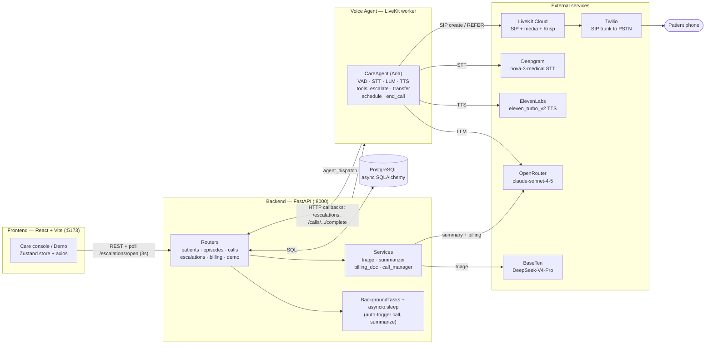
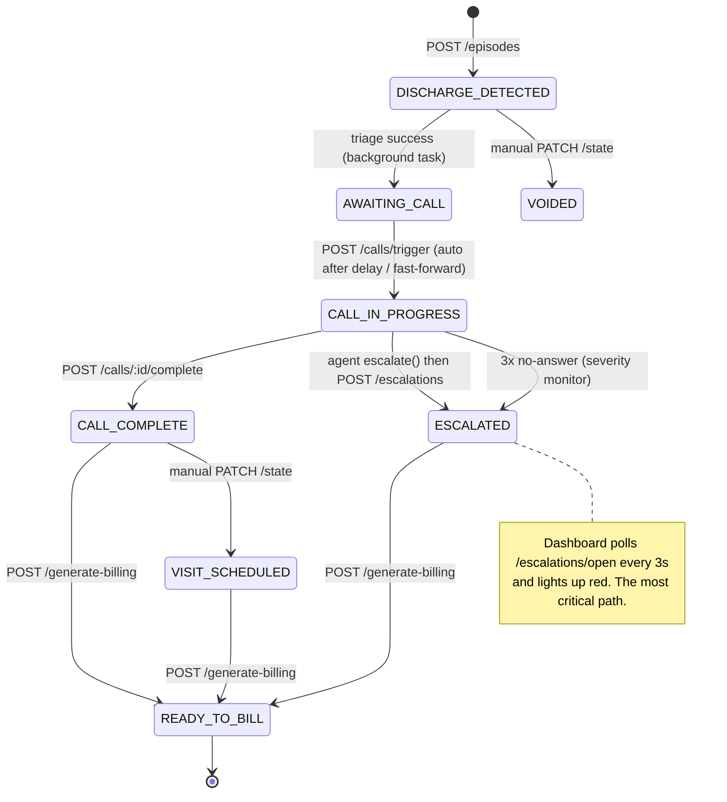
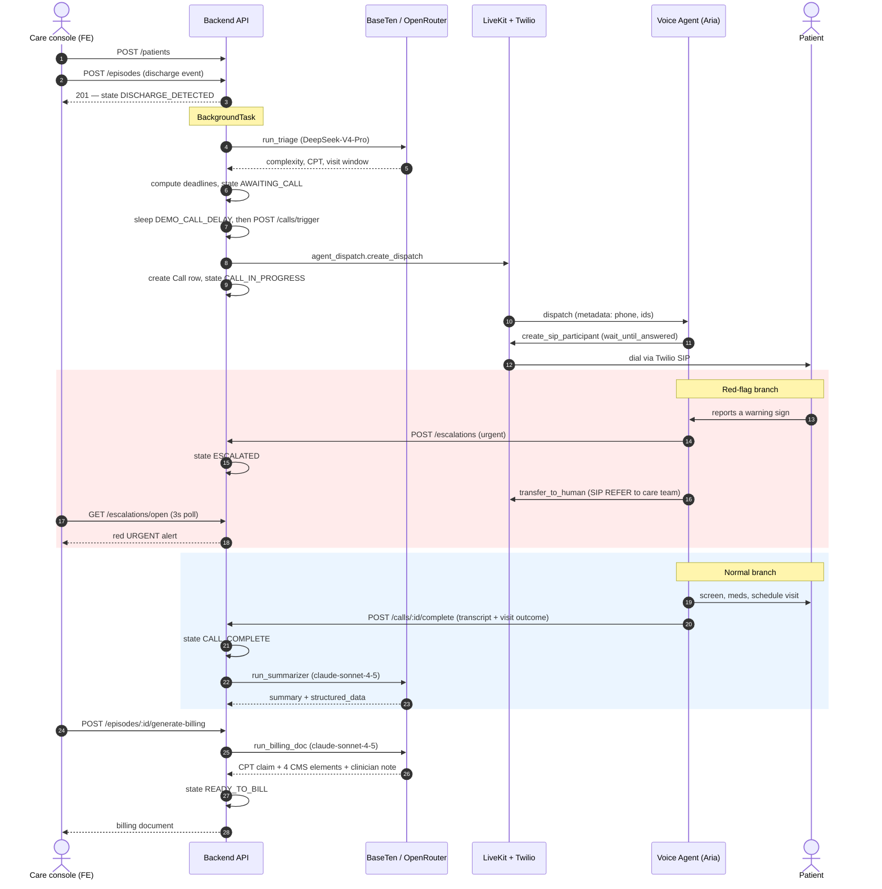
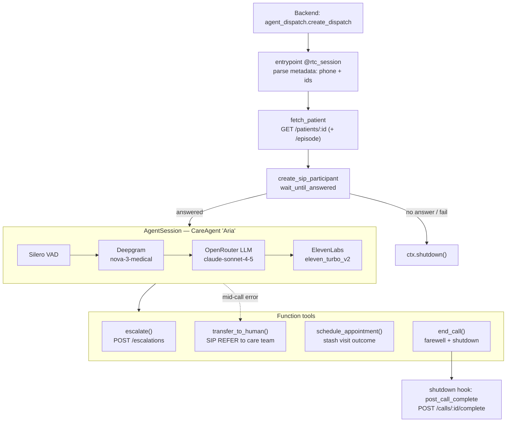
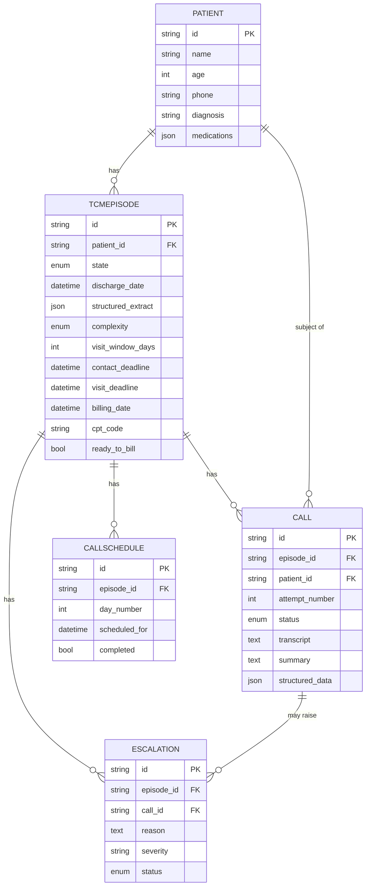

# ContinuaCare — Architecture

ContinuaCare is a **Transitions of Care Management (TCM)** automation platform. It takes a hospital
discharge event, runs an AI **triage** to classify case complexity and set CMS deadlines, places an
**automated voice follow-up call** to the patient, **escalates red-flag symptoms in real time**, and
produces **CMS-compliant TCM billing documentation** (CPT 99495 / 99496).

The product is built as a three-package monorepo plus a set of external services. Everything is
organized around one entity — the **TCM episode** — and its 8-state lifecycle.

> This document reflects the **code as implemented** (`packages/`), which has drifted from
> `CONTINUACARE_MASTER.md` in a few places. Where the running system differs from the original spec,
> that is called out inline. See [Implementation status](#implementation-status-spec-vs-code).

| Package | Stack | Responsibility | Port |
| --- | --- | --- | --- |
| `packages/frontend` | React 18, TypeScript, Vite, Zustand, axios | Care console / live demo dashboard; polls open escalations every 3s | 5173 |
| `packages/backend` | FastAPI, async SQLAlchemy, asyncpg, PostgreSQL | Orchestration brain: REST API, episode state machine, triage/summary/billing LLM calls, escalation handling | 8000 |
| `packages/agent` | LiveKit Agents (v1.5+), Deepgram, ElevenLabs, OpenRouter | One live outbound phone call: STT → LLM → TTS, screens for warning signs, escalates / transfers / schedules | worker |

---

## 1. System component map

How the packages, the database, and the external services connect, and which direction data flows.



**Note the LLM topology** — there is no direct Anthropic SDK call anywhere. Every LLM request goes
through an OpenAI-compatible client:

- **Triage** → BaseTen, model `deepseek-ai/DeepSeek-V4-Pro` (`services/triage.py`)
- **Call summary** and **billing doc** → OpenRouter, model `anthropic/claude-sonnet-4-5`
  (`services/summarizer.py`, `services/billing_doc.py`)
- **Live call conversation** → OpenRouter `anthropic/claude-sonnet-4-5` via the LiveKit `openai`
  plugin (`packages/agent/agent.py`)

---

## 2. Episode state machine

`TCMEpisode.state` ([`models.py`](packages/backend/models.py)) is the spine of the product. Solid
edges are automated by the backend; dashed edges are **manual transitions** via
`PATCH /episodes/{id}/state` (used for demo control and coordinator overrides).



Enums in code: `EpisodeState` (the 8 states above), `ComplexityLevel` (HIGH / MODERATE),
`CallStatus` (SCHEDULED / IN_PROGRESS / COMPLETED / NO_ANSWER / FAILED),
`EscalationStatus` (OPEN / RESOLVED).

---

## 3. End-to-end sequence

The full happy path plus the two branches that matter most — the **red-flag escalation** and the
**normal completion**.



A third path — **no answer** — is handled by `services/call_manager.py`: `attempt_number` is counted
on `POST /calls/trigger`; after `MAX_ATTEMPTS = 3` no-answers the episode is escalated with severity
`monitor` (3 attempts is still CMS-billable). The automatic retry scheduler between attempts is
currently a stub (see [Implementation status](#implementation-status-spec-vs-code)).

---

## 4. Voice agent pipeline

What happens inside the LiveKit worker for a single call ([`agent.py`](packages/agent/agent.py),
[`care_agent.py`](packages/agent/care_agent.py), [`tools.py`](packages/agent/tools.py)). The backend
**dispatches** the agent; the **agent itself** places the SIP call and waits for the patient to pick
up before speaking.



Key behaviors:

- **Audio path**: Krisp `BVCTelephony` noise cancellation cleans inbound audio; turn-taking is
  STT-driven (Deepgram end-of-speech) with adaptive barge-in and preemptive generation for low latency.
- **System prompt**: built per call by `build_agent_prompt(patient)` in
  [`prompts.py`](packages/agent/prompts.py), which injects **diagnosis-specific warning signs** from
  the `WARNING_SIGNS` map (heart failure, COPD, pneumonia, AMI, hip/knee replacement, diabetes,
  default). The agent introduces itself as **Aria** and follows a fixed call flow: confirm identity →
  wellbeing + warning-sign screen → medications → schedule visit → close.
- **Red flag**: the agent calls `escalate(reason, severity="urgent")` (→ `POST /escalations`) and then
  `transfer_to_human()` (SIP REFER to `CARE_TEAM_PHONE_NUMBER`) — this is the product's headline behavior.
- **Completion is end-path-agnostic**: `schedule_appointment()` only stashes the visit outcome on the
  session; the transcript + outcome are posted **once** by the `post_call_complete` shutdown hook, so
  agent-ended calls, patient hangups, and mid-call errors all complete the call exactly once. The
  Claude summarizer then runs on the backend and merges its clinical fields with the agent's booking facts.

---

## 5. Data model

Five tables in [`models.py`](packages/backend/models.py). `CallSchedule` exists and is read by the
calendar/reset endpoints but is **not populated** by the current create flow (see implementation status).



---

## 6. API surface

All endpoints are mounted in [`main.py`](packages/backend/main.py). The escalation endpoints are the
most important — they are the real-time safety path.

| Router | Method & path | Purpose |
| --- | --- | --- |
| patients | `POST /patients` | Create a patient |
| patients | `GET /patients` | List patients (console roster) |
| patients | `GET /patients/{id}` | Patient detail |
| patients | `GET /patients/{id}/episode` | Most recent active episode (agent reads this at call start) |
| episodes | `POST /episodes` | Discharge event → triage + deadlines + auto-trigger (background) |
| episodes | `GET /episodes/{id}` | Episode detail + state |
| episodes | `PATCH /episodes/{id}/state` | Manual state transition (demo / overrides) |
| episodes | `GET /episodes/{id}/schedule` | Calls + scheduled slots for the calendar view |
| calls | `POST /calls/trigger/{episode_id}` | Create Call, dispatch agent, state → CALL_IN_PROGRESS |
| calls | `POST /calls/{id}/complete` | Agent posts transcript + outcome → summarizer |
| calls | `POST /calls/{id}/no-answer` | Agent reports no answer → retry / escalate |
| calls | `GET /calls/episode/{episode_id}` | All calls for an episode |
| **escalations** | **`POST /escalations`** | **Agent posts a red flag → state ESCALATED (most critical)** |
| escalations | `GET /escalations/open` | Dashboard polls this every 3s |
| escalations | `PATCH /escalations/{id}` | Acknowledge / resolve |
| billing | `POST /episodes/{id}/generate-billing` | Generate CPT claim + CMS doc, state → READY_TO_BILL |
| billing | `PATCH /episodes/{id}/billing-doc` | Save clinician edits, face-to-face date, med rec |
| demo | `POST /demo/fast-forward/{episode_id}` | Skip the call delay, dial now (DEMO_MODE only) |
| demo | `GET /demo/reset` | Wipe all data between demos (DEMO_MODE only) |
| health | `GET /health` | Liveness check |

---

## 7. Scheduling & billing rules

**Deadlines** (computed in [`episodes.py`](packages/backend/routers/episodes.py) after triage):

| Deadline | Rule |
| --- | --- |
| Contact deadline | discharge **+ 2 business days** (`_business_days_from`, skips Sat/Sun) |
| Visit deadline | discharge **+ `visit_window_days`** (7 if HIGH, 14 if MODERATE) |
| Billing date | discharge **+ 30 days** (date of service) |

**Complexity → billing** (from the triage LLM; when uncertain, classify HIGH for patient safety):

| Complexity | CPT | Face-to-face window |
| --- | --- | --- |
| HIGH | `99496` | within 7 days |
| MODERATE | `99495` | within 14 days |

A billable TCM claim requires the **4 CMS elements** the billing prompt asserts: discharge date, first
interactive contact date, face-to-face visit date, and the medical decision-making (complexity) level.

**Call retry**: `MAX_ATTEMPTS = 3`; demo retry delay 10s, prod 60min (`services/call_manager.py`).
After 3 unanswered attempts → escalation severity `monitor`.

**Demo mode** (`DEMO_MODE=true`): unlocks `/demo/fast-forward` and `/demo/reset`, and compresses
timing — the first call auto-fires `DEMO_CALL_DELAY_SECONDS` after triage (default 15s in code).

---

## 8. The three backend LLM prompts

All three live in [`packages/backend/prompts.py`](packages/backend/prompts.py) and must return **raw
JSON** (the services strip code fences and `json.loads` the result).

| Prompt | Service | Provider / model | Inputs | Output (key fields) |
| --- | --- | --- | --- | --- |
| `DISCHARGE_ANALYSIS_PROMPT` | `triage.py` | BaseTen `DeepSeek-V4-Pro` | age, known medications, discharge notes | complexity, complexity_rationale, visit_window_days, cpt_recommendation, structured extract |
| `CALL_SUMMARY_PROMPT` | `summarizer.py` | OpenRouter `claude-sonnet-4-5` | patient, diagnosis, discharge date, attempt #, transcript | summary, visit_scheduled, red_flags, sentiment, next action |
| `BILLING_DOC_PROMPT` | `billing_doc.py` | OpenRouter `claude-sonnet-4-5` | dates, complexity, CPT, med-rec, outreach log, escalations | claim (cpt_code, ready_to_submit), CMS elements, clinician_note |

---

## Implementation status (spec vs code)

The running system differs from `CONTINUACARE_MASTER.md` in these ways — captured here so the diagrams
above are trustworthy:

- **No APScheduler / no `scheduler.py`.** The first call is auto-triggered by a FastAPI
  `BackgroundTask` that runs triage, sleeps `DEMO_CALL_DELAY_SECONDS`, then POSTs `/calls/trigger`.
  APScheduler is a dependency but is not wired; `call_manager._schedule_retry` is a logging stub, so the
  multi-call cadence (`high [0,2,6,13,20,29]`, `moderate [1,6,13,29]`) and automatic retries are
  **design intent, not yet implemented**. `CallSchedule` rows are likewise not created by the flow.
- **Agent dials, not the backend.** The backend calls `agent_dispatch.create_dispatch`; the agent
  places the outbound SIP call via `create_sip_participant(wait_until_answered=True)`.
- **LLM routing.** Triage runs on **DeepSeek-V4-Pro via BaseTen**; summary, billing, and the live call
  all run on **Claude Sonnet 4.5 via OpenRouter** (OpenAI-compatible SDK / LiveKit `openai` plugin) —
  not the Anthropic SDK and not Deepgram-Whisper fallback.
- **Frontend defaults to mock data.** `src/api.ts` runs on seed data unless `VITE_USE_MOCK=false`; the
  typed endpoint helpers map 1:1 to the API surface above for live mode.
- **`VISIT_SCHEDULED` / `VOIDED`** are reached only via the manual `PATCH /episodes/{id}/state` endpoint;
  the `schedule_appointment` tool records the booking outcome but does not itself advance episode state.

---

## Running it locally

```bash
# Postgres
docker run --name continuacare-db -e POSTGRES_PASSWORD=pass -e POSTGRES_DB=continuacare -p 5432:5432 -d postgres

# Backend (packages/backend)
pip install -r requirements.txt
uvicorn main:app --reload --port 8000      # docs at :8000/docs

# Agent (packages/agent, separate venv)
pip install -r requirements.txt
python agent.py

# Frontend (packages/frontend)
npm install && npm run dev                 # :5173
```

Environment keys (`.env` at repo root) include `DATABASE_URL`, `BASETEN_API_KEY`,
`OPENROUTER_API_KEY`, `DEEPGRAM_API_KEY`, `ELEVENLABS_API_KEY` / `ELEVENLABS_VOICE_ID`,
`LIVEKIT_URL` / `LIVEKIT_API_KEY` / `LIVEKIT_API_SECRET` / `LIVEKIT_SIP_TRUNK_ID`,
`CARE_TEAM_PHONE_NUMBER`, `BACKEND_URL`, and `VITE_API_URL`. Patient phone numbers must be E.164.
